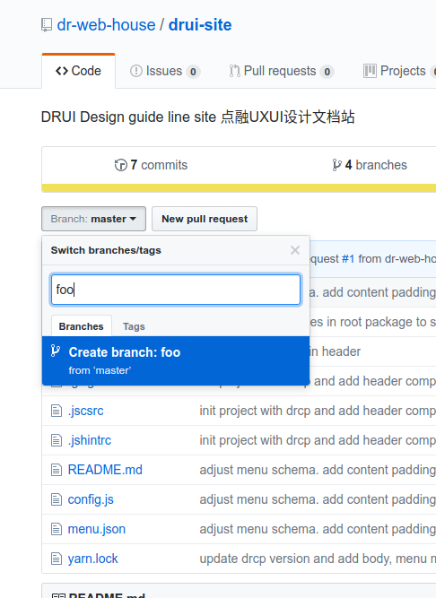
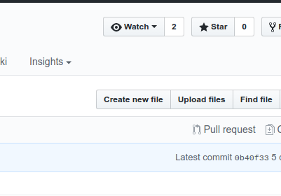
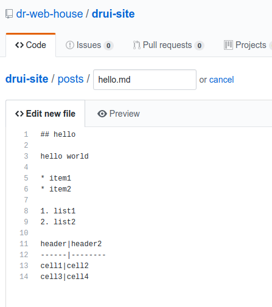
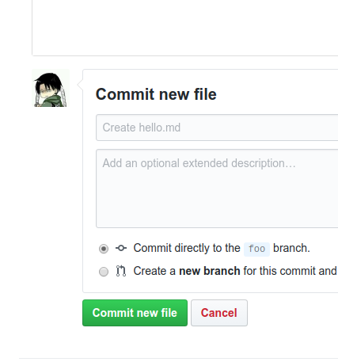
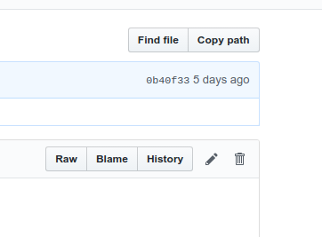
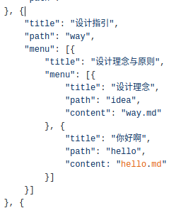
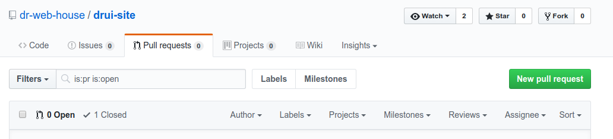
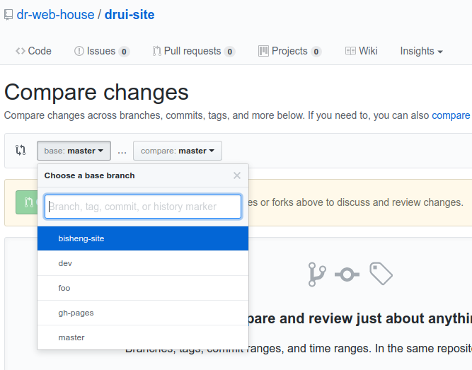
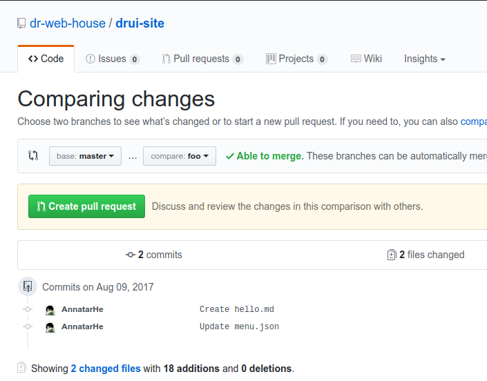
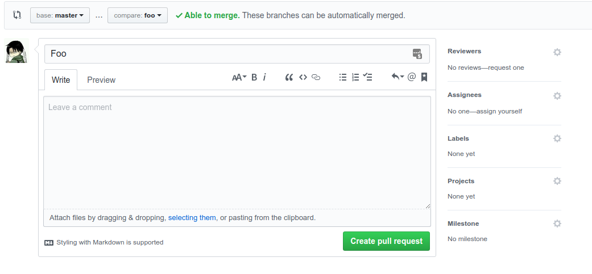

# drui-site

DRUI Design guide line site 点融UXUI设计文档站

## 文章编写

### 1. 开分支

首先打开项目，点击 `branch` 输入一个分支名



### 2. 编辑内容

进入目录 `src` -> `drui-config` -> `posts`，进入页面后点击 `create new file`



编写文档，可以点击`preview`预览写好的文档。请在需要换行的时候，按两下回车键，多空出一行，而不是单纯的换行。

需要跳转到章节的地方可以这样写, 标题的跳转链接需要以`#`开始，后接章节名称

```markdown
[这里是个超链接，链接到文章章节上](#我是个标题)

## 我是个标题
```



然后下滑到底部，点击 `commit new file`，文件就被编辑完成了。



### 3. 调整目录结构

然后回到 drui-site 主页，进入文件 `src` -> `drui-config` -> `menu.json`, 单击铅笔图标



找到适合的层级结构，写入对应的 `title`, `path` 和 `content`, 如果此条属于大的分类，请加入字段`"type": "black"` 表明这个结构应该用黑色字显示



依旧是点击底部一个绿色的 `Commit changes`, 这样，菜单栏的 `设计指引` -> `设计理念与原则` -> `你好啊` 就被创建成功了，但是依旧不能立即查看到。

### 4. Pull Request

点击上面的 `Pull request` 的 Tab, 然后点击右边绿色的 `New pull request`



在 *Compare changes* 下面的 `base` 换成 *master*， 将 `compare` 换成刚刚创建好的分支



然后点击 `Create pull request`



写入一些更新信息，也可以不写，之后点击 `Create pull request` 即可。



告知维护的开发人员，他在看过没问题之后会合并入主分支，页面上就会有所体现。

## 图片添加

请将图片粘贴进入项目`src` -> `drui-config` 下的 **images** 目录下，可以自行开文件夹整理，然后在 .md 文件中这样引用即可：

```md

```

> 请注意： `../` 是必须的，请务必加上。**foo.jpg**可以改成对应的目录结构

如果需要图片浮动在右边，请改用 html 标签的形式。而且写文章的时候需要把图片写在文字前面。

```html

```

* **align**属性中表明是浮动在右边的

* **alt** 属性会显示在图片底部，属于简单的 title

* **description** 属性会显示在 alt 下面，可以简单地写一些比较长的文字，但是不能换行

如图所示:


两张图片

```html
<div hasmanyimage>
    
    
</div>
```

正确和错误需要写`data-isError="true"`和`data-isError="true"`

大于两张图片，请这样使用：

```html
<div class="drui-md-multi-images">
    
    
    
</div>
```

多列图片布局：

```html
<div>
    <div hasmanyimage>
        
        
    </div>
    <div hasmanyimage>
        
        
    </div>
</div>
```

如果有两个 hasmanyimage 属性的内容，则为两行，如果有三个，则为三行

## 附录

[markdown 语法学习](https://guides.github.com/features/mastering-markdown/)

