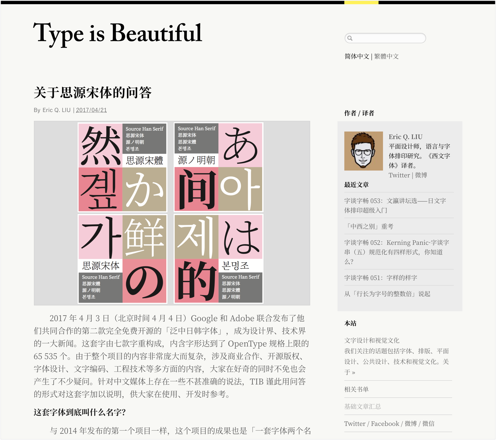

# 界面文字·Web
Web 界面里的文字排版
在 Web 界面载体上所呈现的文字排版，应该致力于以下几个特征——

### Ⅰ. 特别清晰（Clarity）

在 Web 上排版，基础要打好：字型要选对。如今无论是中文英文，黑体宋体、衬线无衬线体，都有很多的选择。除了苹果公司出品的，和 Adobe，Google 出品的思源系列；中文还有信黑体、汉仪旗黑，方正新书宋；英文正文排版可以用无衬线 FF DIN，Verdana，Gotham。衬线 Garamond，Mercury Display。

### Ⅱ. 易读性高（Legibility）

中文主要以方块字为主，每个字代表一个语素，不像英文词漏掉字母也可以理解词义，中文需要每个字、语素都要读到才能理解，文字自然是越方便阅读越好。

### Ⅲ. 保持连贯（Consistency）

人的眼睛阅读时会跳读、停顿、往回看，不是只会逐字看。所以同一界面，最好保持一样的字体或字型，整个网站、整篇文章使用同一款字型的不同字重形式是比较便捷的做法；又或者要使用同样的对齐方式，不能上一页还是左对齐，下一页同类的就居中对齐了。

### Ⅳ. 快速传达（Fast）

如果优化排版，减少阅读时间，也许用户在前几秒的第一印象就决定看完这段字，提高吸引度。
设计时要与手机差异化排版（Diversity）。台式电脑屏幕大、容纳文字多，可以用更多的样式和排版。

-------

### 一个标题可能只有几个字，听起来不需要特别照顾，只需按照默认设置即可。而一段字，似乎多注意下行间距和页面左右间距就完成排版了。但若你是个更加挑剔的设计师，你实际上需要考虑的有——

### Ⅰ. 字词间距（CSS: letter-spacing, word-spacing）

主要发生在标题排版里：是否需要改变字间距，使得宽松或紧驰。需要查看具体应用环境，及这个标题的含义和下方文字的用处是什么。是否和其他段落有连带关系。正文不要改变文字的字词间距，字体设计师和厂商在创作字体时已经细细推敲过了，如果你再改变会破坏字型的基础显示效果。

### Ⅱ. 字重粗细（CSS: font-weight）

这一招是屏幕文字排版能拉开层级的主要手段。拿排版基础单位：标题与正文来举例，是标题先用细体，然后变化到底层正文用粗体？还是反过来，标题先用粗体，接着的正文再用细体。

### Ⅲ. 行高设置（CSS: line-height）

这一招是屏幕文字排版能拉开层级的主要手段。拿排版基础单位：标题与正文来举例，是标题先用细体，然后变化到底层正文用粗体？还是反过来，标题先用粗体，接着的正文再用细体。

### Ⅳ. 文字颜色对比（Color Contrast）

可以置于灰度下查看对比是否秩序到位或者和谐。

### Ⅴ. 段宽设置（CSS: max-width）

主要指的是超过手机尺寸的设备，要考虑人与设备间的距离、舒适视觉宽度两个纬度。

### Ⅵ. 尽量居左对齐（CSS: text-align: left），除非特殊需要

如解释说明；引号「“」首字伸出段落（CSS: text-indent: -2em）。

### Ⅶ. 设置合适的段间距（CSS: margin-top:0 / margin-bottom:x）

纯文字段落会让人看得累，两个段落之间，何不吹给用户一阵微风：设置合适的段间距。让每个段落也能够透气，优雅地留白。

### Ⅷ. 界面世界非现实世界印刷，文字段落段首不空格

### Ⅸ. 若你使用衬线字体、明体宋体作为段落字型，应设置比黑体大一些的字号

-------

## 三、Web 界面里的中英文字混合排版

中文和英文一起出现的概率很高，因为现代汉语信息要跟世界接壤，会夹杂着英文文字，不可避免。

中文从外形上来看，主要以方形为主，也就是被常称为方格字。但是中文还有菱形原型三角形的相对少量文字，不可忽略，这导致中文自身本来的使用就对视觉一致有着较高要求；不像英文是拼音文字，有了 X 高就可以较方便的组合 26 个字母。一个中文字库最少要含近 7 千字，也是导致了中文字库发展缓慢的决定性原因之一。

### Ⅰ. 首先要明确如何使用中文和英文文字

在中英文搭配成为既定现实的前提下，需要对搭配的双方文字都要熟知，这也是设计师应该掌握的基本专业技能。毕竟专业的事情，还是必须要有准备才能开始。使用一款字体字型，尽可能多的去了解他们的来源和设计用途，才能不被工具束缚，自在发挥。

### Ⅱ. 风格气质要搭

不能牛唇不对马嘴，要遵守像黑体搭配无衬线体的一般原则。

### Ⅲ. 强迫症选项

现在设计界流行使用的大多字库内中英文字搭配做得还可以，比如苹方。但苹方内嵌的英文字族细看还是跟苹方的中文字族不协调，如果你有些许强迫症，还是要手动调整的。所以苹果在 iOS 上使用了 San Francisco 与之搭配。

### Ⅳ. 如果是在使用字库字体输入一段文字的话

常识一，要使用半角输入法；二，除了专有全角符号如《》，尽量使用半角；三，中文跟英文接触的地方都要加一个半角空格等。

### Ⅴ. 如果是在进行中英文组合细调的时候

通常会将中文字高的 80% 与英文的基线高度相一致；中文与阿拉伯数字组合使用时，汉字一半应高出数字十分之一左右。在包含有数字、英文、汉字的环境下，通常阿拉伯数字要和英文的字保持一致。

### Ⅵ. 大多数问题出现后，都可以通过增加英文字号和 X 高度来解决

比如在 sketch.app 做设计稿时中文用苹方，英文用 San Francisco (以下都简称 SF)。 但常常遇到同一个字号下，SF 看起来比中文小很多，便捷的方法就是把 SF 的字号调大一些。

-------

## 四、现代界面文字排版里少见的宋体

如今在中国，设计师可以挑剔地使用字库里的字体了。可用的字体都已经可选的很多，不像几年前只有一些基础的黑体宋体翻来覆去地用。那时候的黑宋体还只是从印刷业复刻过来的字体，并不是专为屏幕等界面而生的。而现在，不仅黑宋体的数量繁多，每一款的气质风格也被塑造出来，可以去契合更多产品和用处。

在屏幕世界里，现实世界里印刷等媒介见得比较多的，代表正式权威的宋体比较少见了，黑体作为互联网的字体代表势力愈发强大。裴瑜的硕士论文调查数据统计里`*3`，无衬线体（中文为黑体）的例图最能决定受众觉得某款字体属于现代风格。

拥抱了现代互联网，就拥抱了黑体。宋体当然不是个坏家伙，只是在特定领域的历史中，总有新的生产力涌起。而这段时间内，是黑体领先罢了。再看 2017 年 4 月 Adobe 和谷歌推出的思源宋体，相信会在越来越多界面里见到他。现在你打开一篇文章，把字号设到 16px 的某款宋体字型，有没有眼前一亮？

-------

# Typography in Practice: 文字排版具体应用

## 一般用系统默认

macOS 使用苹果 Human Interface Guidelines 设计语言之 文字排版定义
字型使用苹果 macOS 苹方和
SF Pro (San Francisco)
Windows 使用微软 Fluent Design System 设计语言之 文字排版定义
字型使用 Windows Segoe UI，雅黑
字型也可选用其他如 SF，苹方，包括谷歌 Roboto & Noto fonts

Universal font-family 设置
font-family: -apple-system, system-ui, BlinkMacSystemFont, "Segoe UI", Roboto, "PingFang SC", "Source Han Sans CN", "Noto Sans SC", "Helvetica Neue", Oxygen, Ubuntu, Cantarell, "Fira Sans", "Droid Sans", sans-serif;

某种字型的字重字号定义例子

协作开发实现字间距、字重、行高、段宽等细节属性
中英混合文字分开定义，不可只用中文字型
中英双语文字图层 double check 用英文字型覆盖图层保证英文字族显示正确。
定制字型时
使用  Web Font 字型时不可任性跟风使用流行字型，慎重
英文 Web Font 前置于 font-family; 中文 Web Font 前置于 font-family
实现中文 Web Font 所需参考资源——
Fontmin ；Fontmin 应用
字蛛
有字库
justfont 就是字
上海驿创
汉仪字库·网页用字
方正字库·开放云平台

实现英文 Web Font 所需参考资源——
Google Fonts 
Fonts.com Web Fonts
Adobe Typekit
Webfonts on MyFonts

em 单位的使用
你在看不同的屏幕时距离不同。在台式电脑的屏幕上 12px 里看起来很小，但在手机上看起来则还好；另外旧的  IE  也无法使用 px 单位进行响应式设计显示，但 em 可以。em 作为字体的单位，比 px 更先进的地方在于它可以跨设备显示更优秀，因为 em 是相对长度单位，是对应对象容器内文本的基础字号进行换算的尺寸。类似于 Android 平台的 dp 单位。
1em 等于当前的字号，2em 等于当前字号的两倍。例如，如果字号是 16 px，那么 1 em 是 16 px；如果字号是 12 pt，那么 2 em 就等于 24 pt。
下面是在 CSS 里一个使用 em 为字体单位设置的例子：

p {
    font-size: 16px;
    line-height: 2em;
    width: 10em;
}
div {
    font-size: 16px;
    border: 1px solid black;
}
span {
    font-size: 2em;
}

前三段的文字字号是: 1x16px = 16px

前三段字段落行高是: 2x16px = 32px

前三段的文字段宽是: 10x16px = 160px

这个区域内的字号本来全设置成了 1x16px = 16px 
但是这句话字号被设置成了 2em, 所以显示字号是 2x16px = 32px

实现效果

参考文献
*1、《基于受众体验的中英文字体选择优化方案探索》，裴瑜，东华大学，2011-12

中文文字、排版延伸阅读
Typo.css - 中文网页重设与排版
Entry.css 中文文章样式库
漢字標準格式 — 印刷品般的漢字排版框架
写给大家看的中文排版指南
簡單做好中文排版 – WANDERER books
少数派写作排版指南 - 少数派
中文文案排版指北（简体中文版） — 码志
Requirements for Chinese Text Layout 中文排版需求
维基百科:格式手册/标点符号

英文文字、排版延伸阅读
PIXEL PERFECT PRECISION
Fontology - fonts.com
The Elements of Typographic Style Applied to the Web

