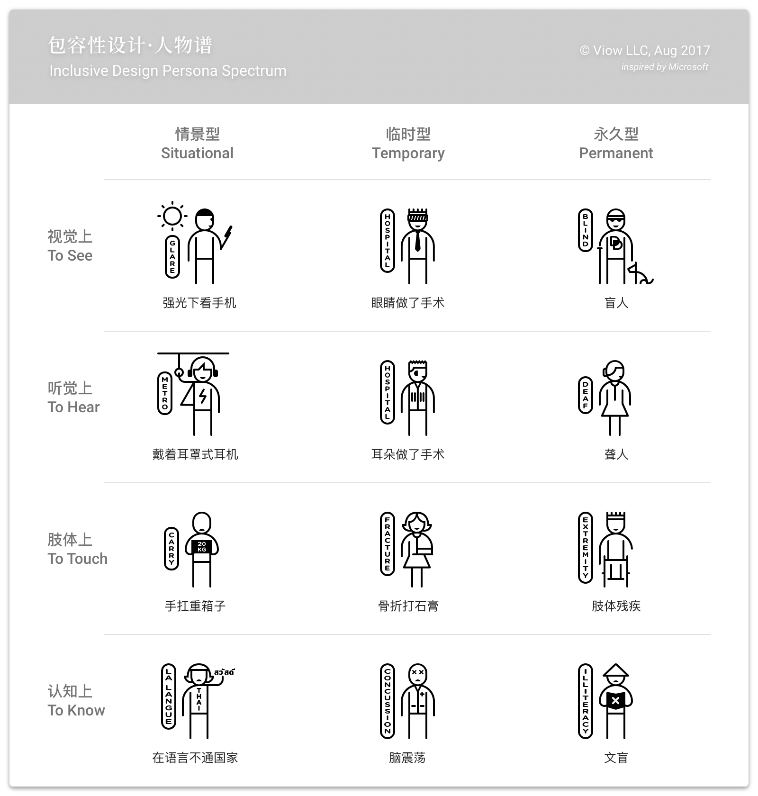

# 无障碍 Accessibility

用户是多样的，其中不排除有视力、听力、肢体灵活度及认知能力较弱的用户。在界面设计时考虑到这些极端用户的存在，做一些用户体验上的优化，可以在最大程度上包容更多的用户。

## 无障碍为人人

“残疾”一词的定义已从之前的“个人身体或能力的限制”转变为现在的“身体能力、物品与环境三者之间的不对等”。微软的inclusive design研究小组从时效性的角度将残疾分为场景型、临时型和永久型三种并建立了相应的人物谱。从人物谱可以看出，考虑永久型残疾用户的需求实际上也同时方便了场景型及临时型残疾的用户。

## 降低产品使用成本

前文提到“残疾”的新定义是身体能力、物品及环境三者的不匹配，而人群是多样的，真正无障碍的产品是让能力最弱的那部分用户都能够使用的产品。理想情况下，残疾是可以被消除的，方法便是降低产品的使用成本，产品的使用成本主要有以下四类：

### 视觉成本——识别、阅读、寻找相关信息需要的成本

* 文字及图形的大小及细节能够得以识别。图形及文字先以达意为前提，舍弃不必要的装饰细节，功能性的文字避免使用装饰字体；
* 前景与背景的对比度适当。WCAG 2.0里规定，文本色（前景色）与背景色至少有4.5:1的对比度，可至[MSFW ContrastRatioCalculator](http://www.msfw.com/Services/ContrastRatioCalculator)计算前景色与背景色的对比度数值；
* 颜色不能作为唯一的识别信号，考虑有红绿色盲用户的存在，且不同文化背景下对颜色的认知有差异；
* 重点信息突出和集中，让用户瞥一眼就能看到最关键的信息。

### 物理成本——准确无误地点击或触摸、输入或滚屏需要的成本

* 操作时热点便于手指点击，44像素最小，即使视觉元素本身小于44像素，热区依旧要大于44像素；
* 提供多种输入的方式，如语音，手写或手势输入等；
* 帮助用户导航，查找内容及定位以减少用户在页面间跳转所需要的点击次数及滑屏次数。

### 记忆成本——为完成目标而必须记住的信息量

* 产品帮助用户记忆，保留用户的历史使用痕迹；
* 将信息分组，短时记忆的容量只有5-7个组块，将信息分组可以扩大短时记忆的容量。

### 认知成本——理解文本、组织结构与产品行为需要的成本

* 界面内容，包括文字和图形是能够被用户所理解的，当由于教育水平或文化差异导致用户有可能有认知上的困难时需在合适的位置提供补充说明；
* 页面操作符合用户预期；
* 界面具有容错性：避免发生错误，页面上给到足够的提示说明；具有安全隐患的操作提交时让用户再次确认；错误发生后能够被发现并且会有可以补救的措施。

