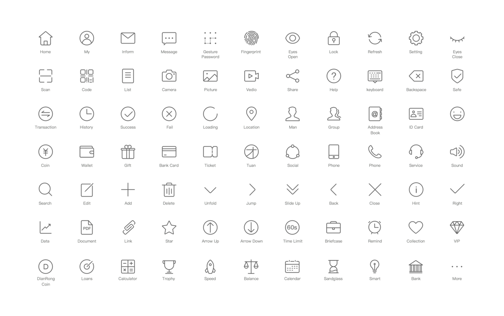
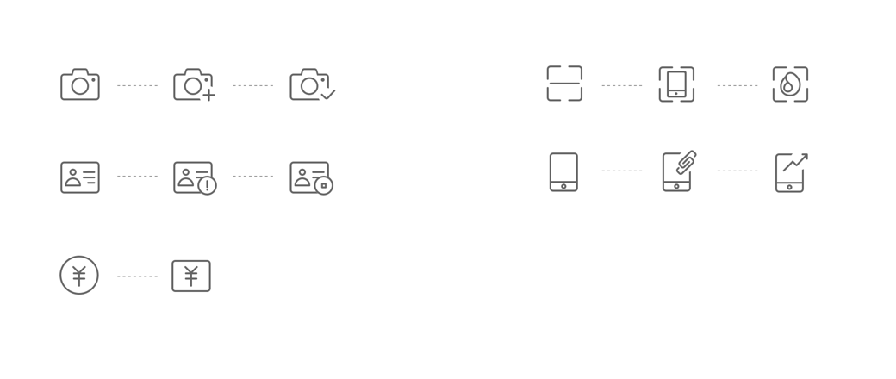
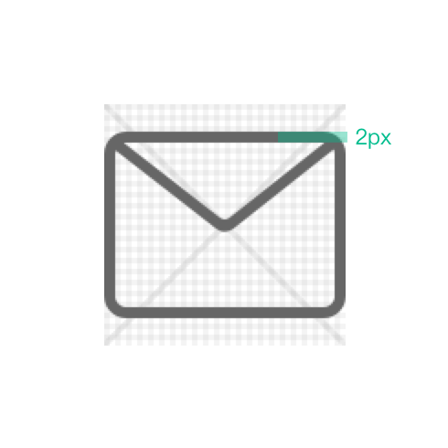
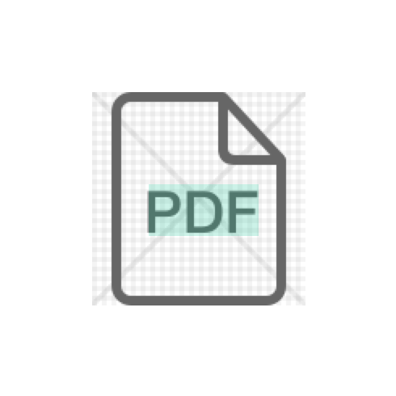

# 图标

图标是具有指代意义的图形，也是一种标识。通过使用图标表达命令，强调状态，表示产品或类别。DianRongUI的图标需要贯彻自身的基本理念，在多产品线上使用保持一致，在设计和使用上需要保持以下原则：

1. **清晰**：简单的图形语言以及高辨识度。直观的图标便于用户识别记忆
* **安全**：在基本造型上保持图形正面呈现
* **统一**：产品中图标风格保持一致且在一个产品中避免出现两种以上的样式

## 通用图标

**图标库**

可供选择的基础图标

**图标延伸**

为了使图标更加达意，基础图形可以根据不同的场景延伸组合

**视觉平衡与网格**

为保持视觉效果一致，在同一尺寸图标下，不同的形状使用不同的轮廓线，以达到最佳视觉平衡

右图为竖长方形和圆形在相同大小下的标准制图

右图为正方形和横长方形在相同大小下的标准制图

**比例缩放**

图标库2.0是以44px为标准制作，在不同场景下图标尺寸会有变化，可等比缩放，其原则保证图形尺寸为偶数，调整线条半像素

##图标细节

**笔画**

DianRongUI单形图标需要保持线条统一，在图标库2.0中，线条粗细使用2px宽度

**圆角**

一致的角度半径也是保持整个图标系统视觉统一的重要元素。
DianRongUI的图标设计中，44px内的图标边角以4px 2px为基本形，在绘制中需要圆角大小从外到内变化

**边角**

在线条末端使用圆角形状，保持整体图标造型统一

**半像素**

为保持图形视觉足够清晰、严谨，在绘制过程中，避免出现半像素，以达到屏显效果

**角度**

图标匹配点融UI安全，清晰的设计理念，在造型中避免出现透视，图形应使用正面形象塑造

**视觉修正**

在字符辅助icon时，为达到视觉平衡，可适当调整当中字符间距，保证达到最优视觉效果

##风格图标

**风格与标准**

图标需要匹配产品视觉的风格，不同产品线你可以在样式上表现有所区别，但在图形意义上需要保证一致。

例如右边Home的图标，它可以是不同样式，但是它们都是房子。

**插画**

每个APP里除了通用图标外，一些插画类图标体现了产品风格，你可以使用任意表现手法，但是每个APP只能使用一种来保证产品各模块视觉统一

