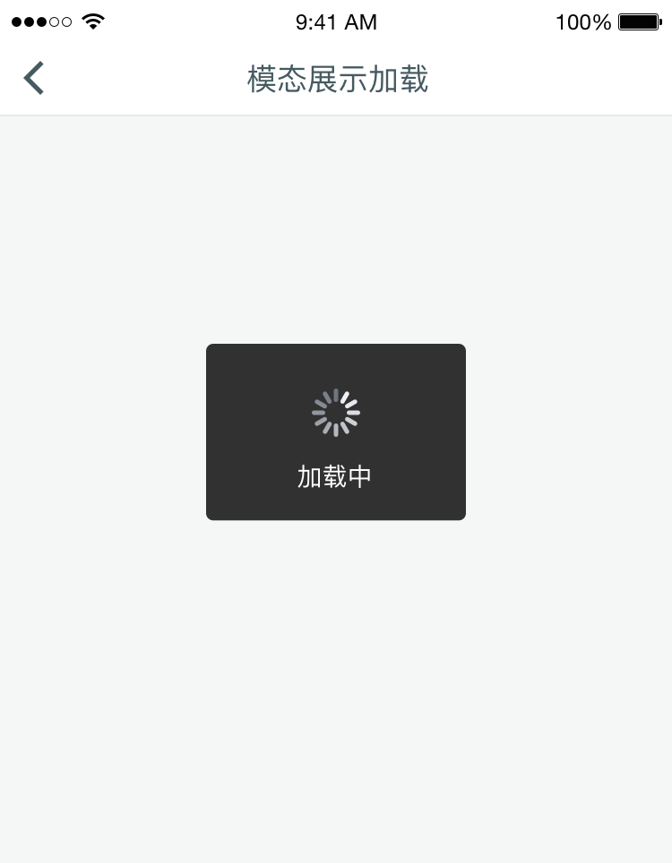
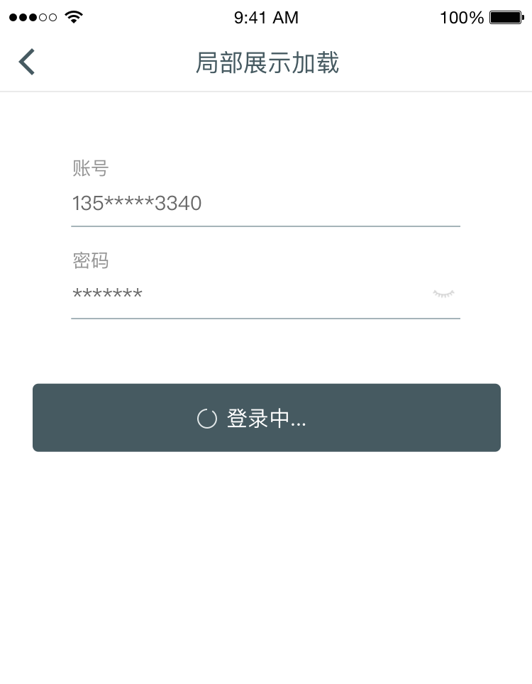

# Activity Indicator 活动指示器
当用户操作所期待的反馈有延时或者需要加载时，活动指示器可以告知要用当前状态，降低用户等待感。

## 呈现方式

### 模态展示

常用的方式，用户完成该页任务后展示

### 局部展示

用户点击按钮后展示

### H5页面加载

H5页面以横向进度条展示

## 出现时机
活动指示器通常用于当前后端需要产生数据通讯时，特别是当后台需要处理数据导致用户需要等待数秒甚至更长时间。
为了避免过度使用，对于短时的等待（比如native app页面间的跳转）通常不需要展示活动指示器。但如果遇到特殊网络情况导致页面一定时间后(比如3秒)仍未加载完成，此时再出现活动指示器方才适合。

