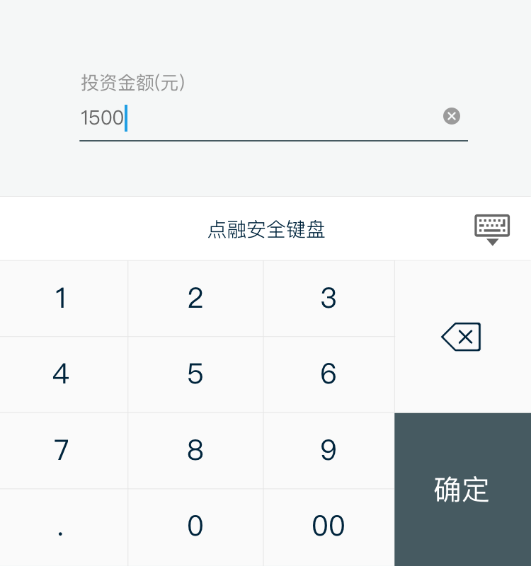
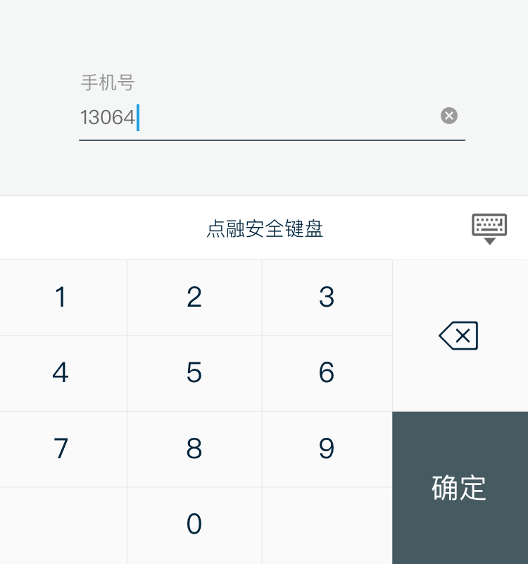
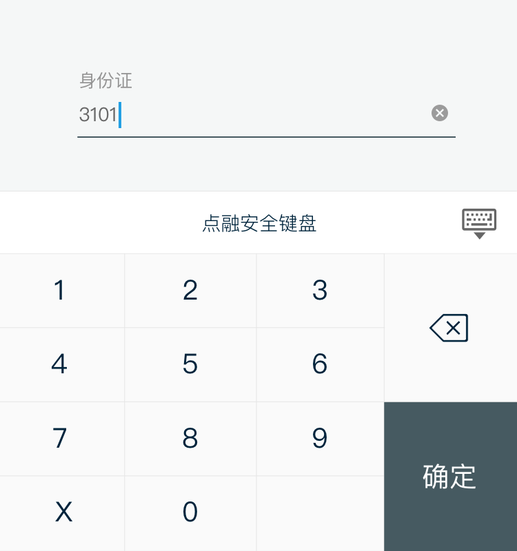
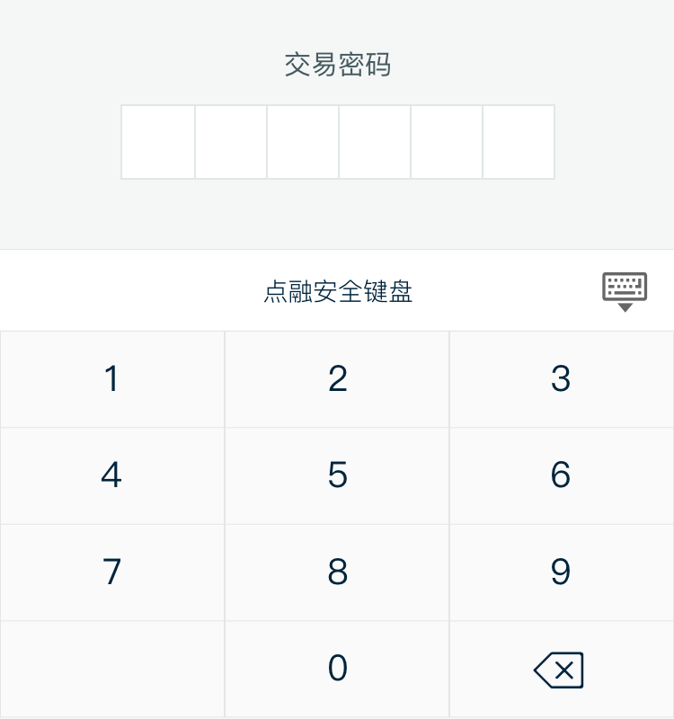

# Customized Keyboard 安全键盘
对于不同的输入场景，为用户提供定制的安全键盘可以方便用户输入的同时，传达「安全」的操作体验。

<!--

| 金融类 | 纯数字类 |
| :--- | :--- |
|   |  |

| 身份证 | 交易密码 |
| :--- | :--- |
|   |  |
-->

## 金额类

金额类键盘带有小数点与双0输入

## 纯数字类

纯数字类键盘除了0-9外不带有任何其他符号

## 身份证

身份证类键盘提供“X”额外输入

## 交易密码

交易密码类键盘由于输入完6位数字后自动判断正误，所以无需“确定”按钮。

