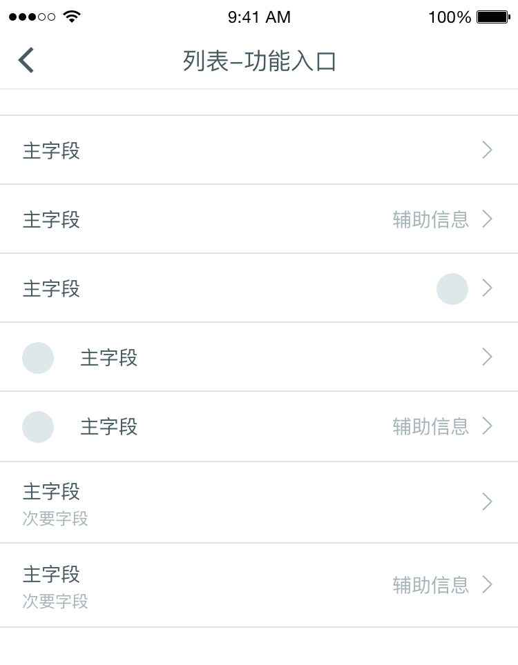
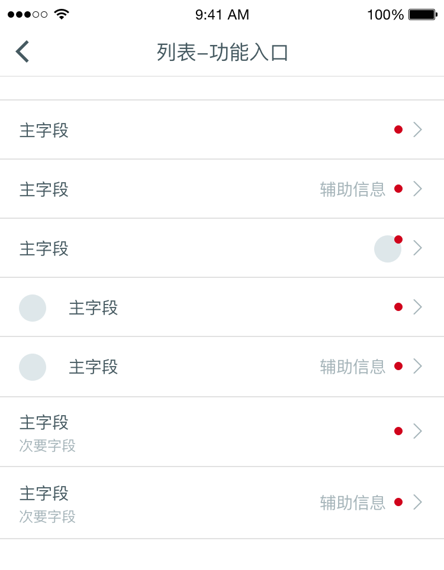
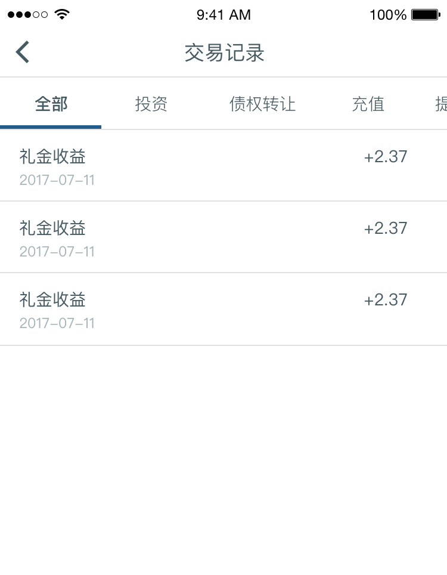
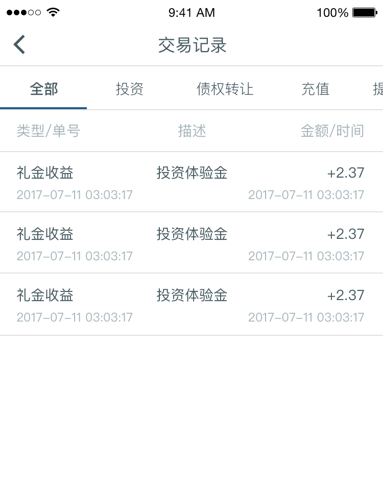
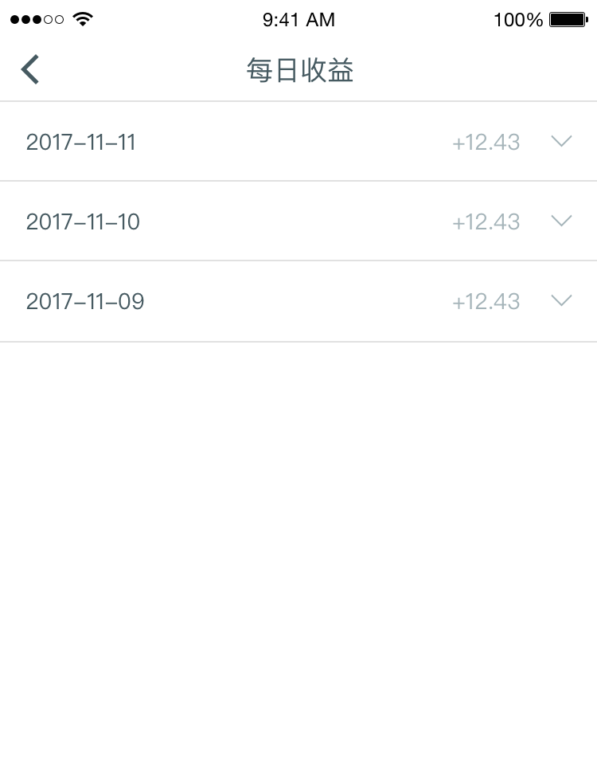
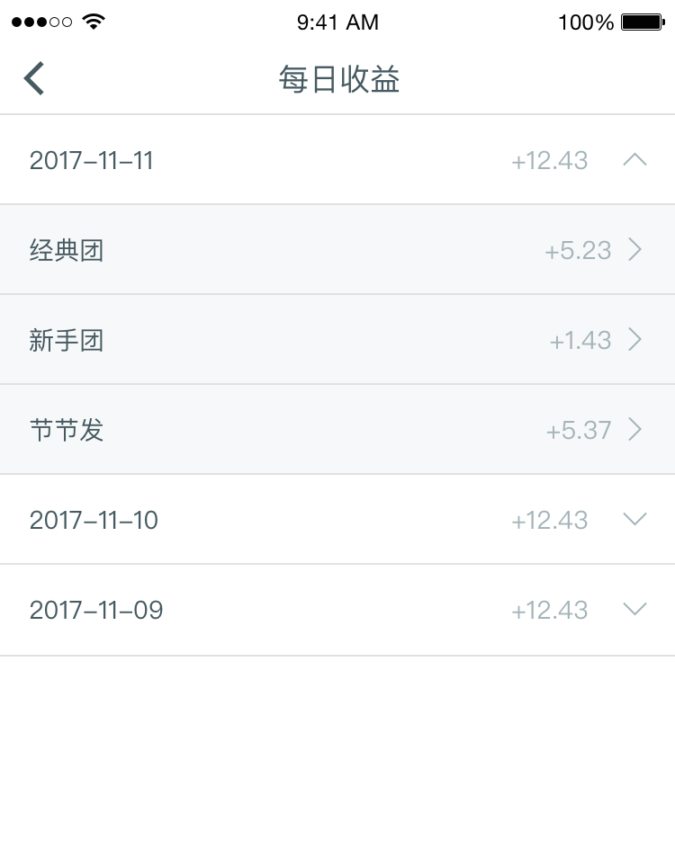
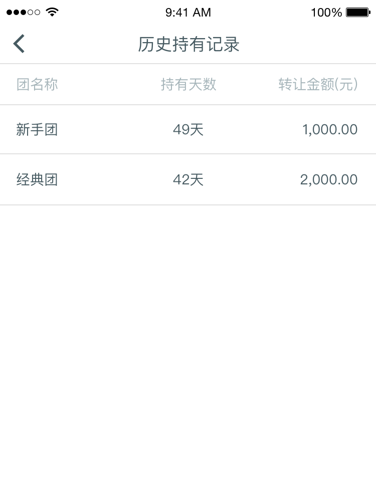
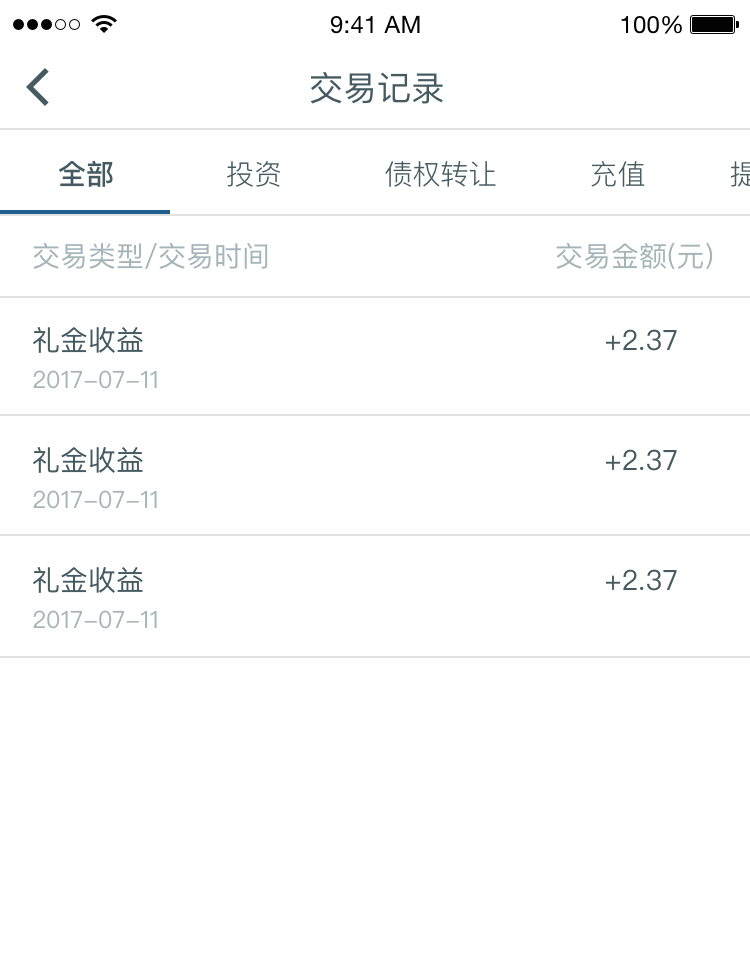

## List 列表
列表通常被用来展示有序的信息。而有序的信息通常分为两种：功能入口与数据表格

### 功能入口

在设计中，我们通常需要展示当前页面层级下，用户可以进入的功能集合。比如app中的设置页条目等。

如图展示了设计中常用的功能入口类型

图中七种类型已涵盖多数设计情形，但设计师仍可根据具体情况调整入口组合。

### Badge 更新提醒

当功能入口中的内容发生更新需要让用户知晓时，通常会在入口处放置badge。

### 数据表格
列表第二种常用场景在于展示数据。通常用于展示类目明细，方便用户快速浏览主要信息数据。

### 字段限制

在桌面端通常会用表格的形式展示底层数据。但在移动端上由于受到屏幕宽度限制，使得字段数量受到限制。设计师需要挑选最重要的字段展示给用户。对于次要内容，可以让用户点击条目后进入详情页查看。
设计师需要**严格限制不必要的字段出现**，已保证页面简洁，提升用户体验

### 交互一致性
如果允许用户点击cell进入次级页面，则所有cell都应当可进入次级页面。不可由于不同的分支条件状态使得在同一列表中有部分cell可点击，而另一部分不可点。

### 可展开的列表

当列表的次级仍然包含列表，则可以使用「可展开列表」，避免用户在不同页面层级中来回跳跃。
请务必注意可展开列表的**箭头方向**。箭头向下表示点击后展开，箭头向上表示点击后收起。

### 表头

对于cell中省略的单位，须在表头中注明单位。为了方便用户快速浏览并理解信息，对于整数类型数据，可以把单位放在cell中。

#### 表头的省略

当用户通过当前场景可以明显感知到cell中内容所表达的信息含义时，可以省略该List的header。

