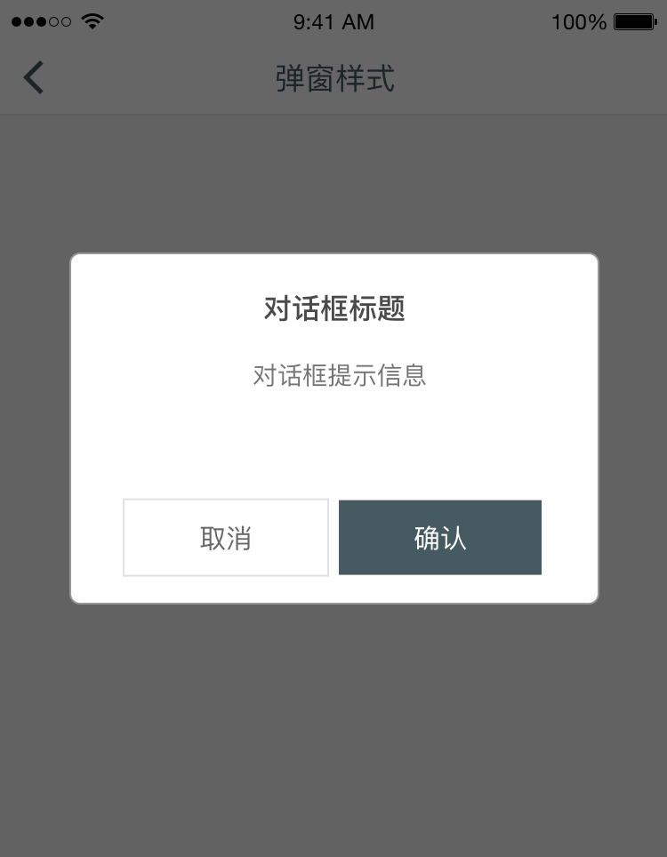

## Modal View 弹出对话框
弹出对话框包含的信息通常需要用户选择操作，其信息通常比较重要。

### 呈现方式

标准弹出对话框有标题、正文、行动选项组成。遇到特殊情况可以去除标题，也可加入图片以便更有效得传达信息。

### 描述性操作

对话框中的操作或者CTA(Call to Action)需使用准确的语言描述操作内容。相比简单的「确认」，可以使用户即使不阅读对话框具体内容，也可以快速给予用户操作预期。

### 积极与消极
请参见 [Data Entry - Button](#/guide/button) 

