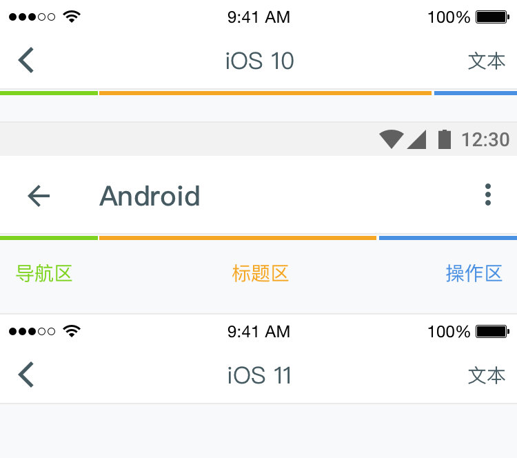
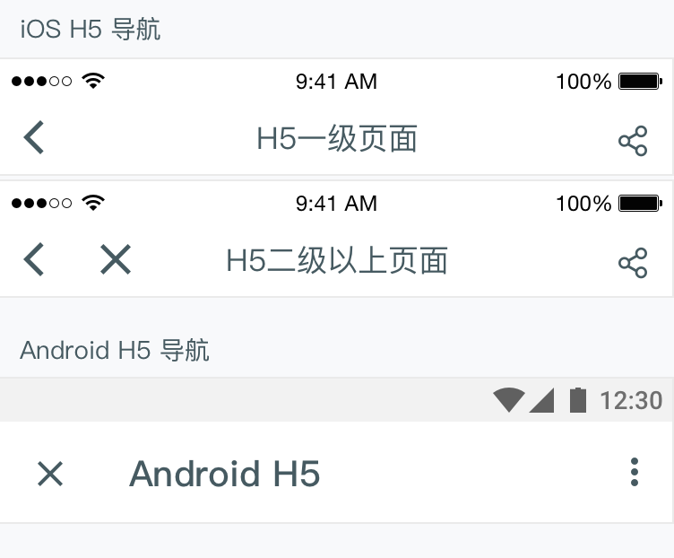

# NavBar 导航栏

导航栏分为导航区、标题区、操作区。

## 导航区：
导航区帮助用户退出当前页面。当页面以Naviagtion View 呈现时通常使用「返回」；当页面以Model View呈现时通常使用「关闭」。
根据设计的需要，一级页面的导航若使用「汉堡包菜单」，也将在导航区呈现。

iOS H5页面：由于H5页面有不可控的层级深度，当进入H5二级或更深层级页面时，导航去额外提供「关闭」按钮，以方便用户返回H5入口。
Android H5页面：由于Android的「返回」操作是系统级别的，因此用户浏览H5页面时，所有「返回」操作都可以通过硬件或系统栏上的「返回」完成。所以当Android平台进入H5页面时，只需要提供「关闭」按钮方便用户快捷退出H5的浏览即可。

## 标题区
标题的文字展示区域固定，超出长度则会被省略。若页面不配置标题，设计师必须确保用户可以感知当前位置。

## 操作区
由于iOS与Android的导航设计有所不同，iOS标题居中对齐而Android标题居左。这使得**Android的操作区会有更多的空间**。而iOS操作区空间有限，通常**iOS操作区内容不超过2个**。

