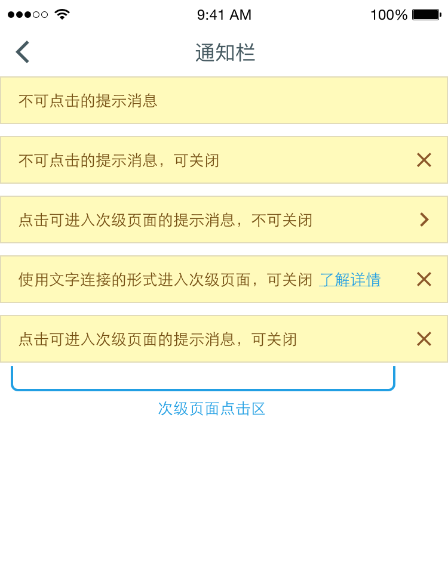
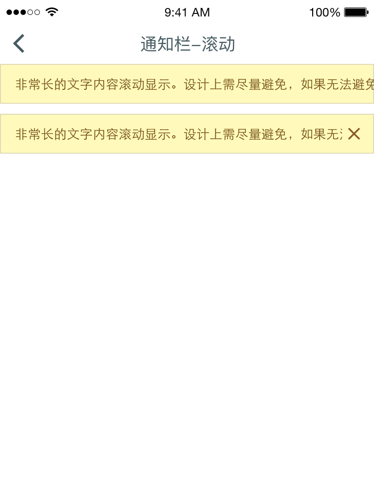

# NoticeBar 通知栏
通知栏通常在导航栏也页面之间插入，用于传达重要消息与内容。

## 常用样式

当用户点击进入次级页面后返回或者主动关闭通知栏后，不可再次出现同样的信息二次打扰用户。

## 使用场景
通知栏通常使用在相对重要或出错场景下。**通知栏切勿展示产品运营类信息，以避免降低通知栏权威性**
对于用户经常浏览的主页面，尽可能避免用户无法关闭通知信息的情况。

## 滚动内容

设计师应当尽可能使通知内容显示在一屏以内。 对于过长的文字内容，可滚动显示。

