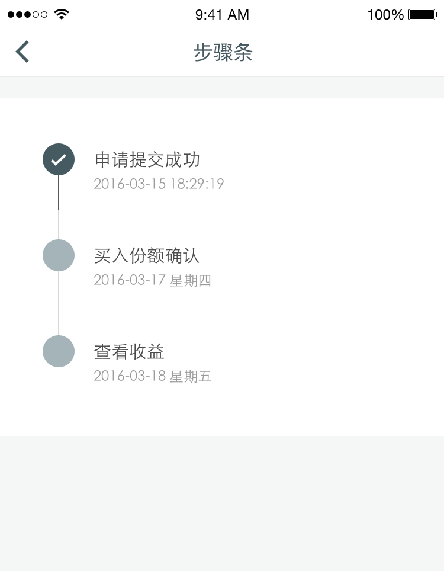

# Steps 步骤条
步骤条展示了步骤的步数以及当前所处的状态。

## 使用场景

当用户的操作与其期待的结果之间有时间间隔需要耐心等待时。设计师可以使用步骤条来为用户做预期管理。明确告知用户步骤进度可以帮助用户理解当前状态，避免恐慌和焦虑。
以下表格列出了常用的场景：

| 用户操作 | 期待结果 |
| :--- | :--- |
| 投资 | 产生收益 |
| 赎回 | 赎回到账 |
| 提现 | 银行卡到账 |
| 基金申购 | 份额确认 |
| 申请借款 | 审核结果 |

