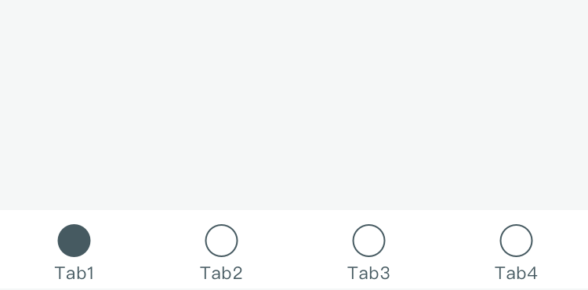

# TabBar 标签栏
标签栏在页面的底部，让用户可以在不同的页面之间快速切换。

## 原则与规范

**不超过5项**
标签栏用来组织信息架构在一个层级的页面。它可以使app信息层级更扁平。项目数量不可超过5项，否则会移动端一行内难以容纳。若一级导航数量过多，应当考虑优化信息架构。

**次级页面避免使用**
如果一级导航使用了TabBar，在次级页面中应避免使用。否则会对用户产生严重困扰。

