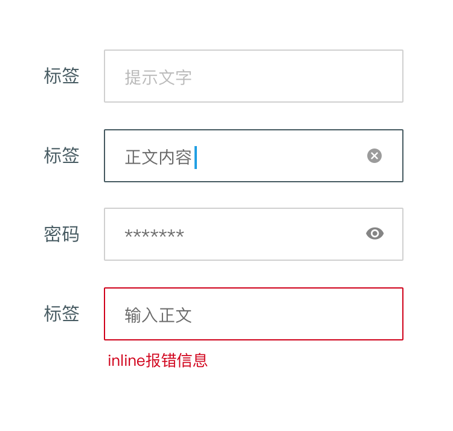
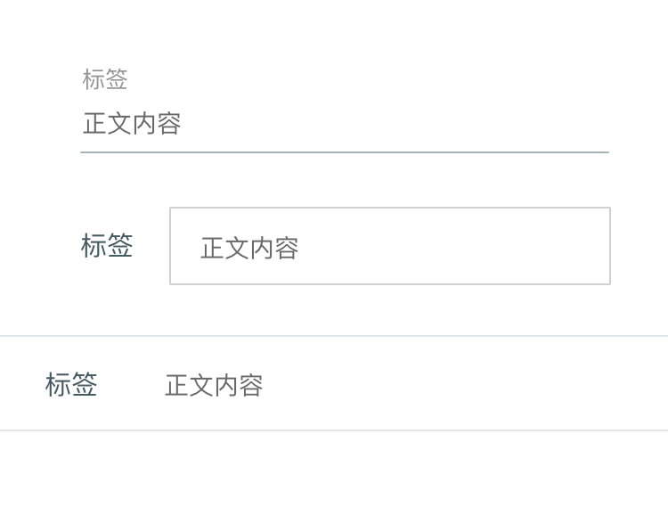
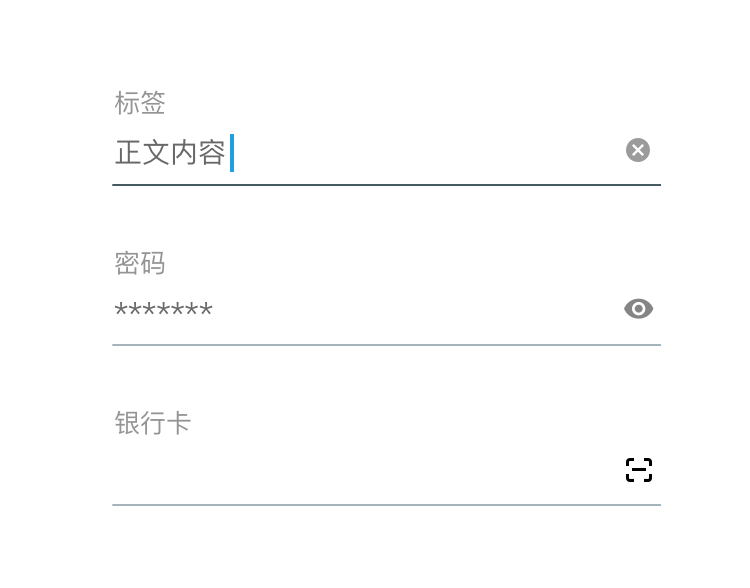
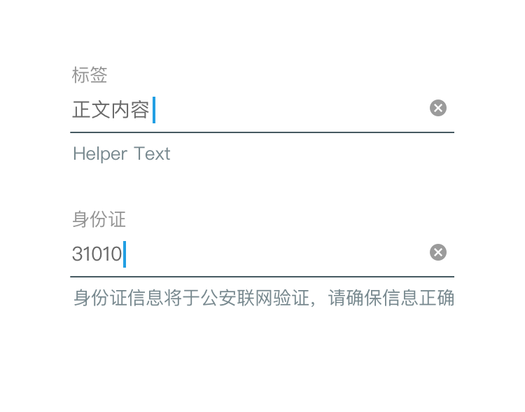

# Text Fields

用户可以通过Text Fields输入、选择、编辑文字。

Text Fields 通常由「标签」, 「提示文字」以及「输入正文」 构成。元素包括「辅助按钮」「inline报错」「辅助提示」等。

## 常用样式

标签和输入框组合布局变化较多（方框、线条、通栏等）。同一个app中若无特殊需要，应当尽可能统一样式。

## 标签

标签文字须直观明了。当同一页面中需要填写字段较少时，甚至可以用提示文字取代标签。

但须注意：**当同一页面需要输入的字段较多时，不建议用提示文字取代标签**。因为一旦用户填写内容，提示文字将消失。倘若提交表单发生报错，会导致用户难以记得对应TextField需要填写的内容。

## 提示文字

提示文字对用户需输入的内容做补充说明，补充说明可以是内容的格式要求、位数要求、信息获取的方法等。提示文字并不是必须，不要为了有提示信息而刻意增加用户阅读负担。

### Floating Label

针对提示文字这个缺点，设计师可以使用Floating Label来兼顾页面简洁与信息输入后的体验。

## 辅助按钮

包括「清除按钮」「明文密码显示/隐藏」「身份证/银行卡扫描」等。
「清除按钮」只有当用户正在编辑有内容的TextField时才会显示。
当TextField右侧已有其他辅助按钮或文字时，可不使用清除按钮。

## inline报错

若用户填写信息不符合要求，app应在「前端提交前」与「后端校验后」两个时间点给予错误反馈。若错误是由确定的某TextFiled产生的，并且页面中有较多表单项目时，建议使用inline报错。

## 辅助提示

当需要对TextField内容做额外说明时，可以使用「辅助提示」信息。该提示通常控制在1~2行内。可以固定显示，也可以只当用户激活输入时显示。

