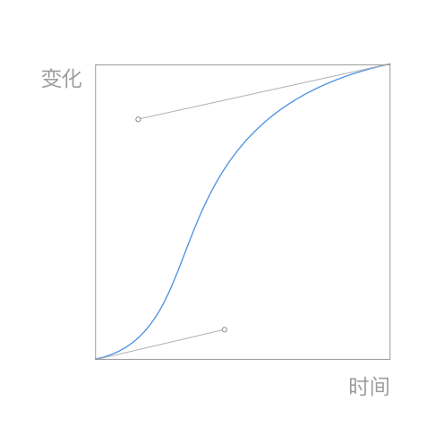
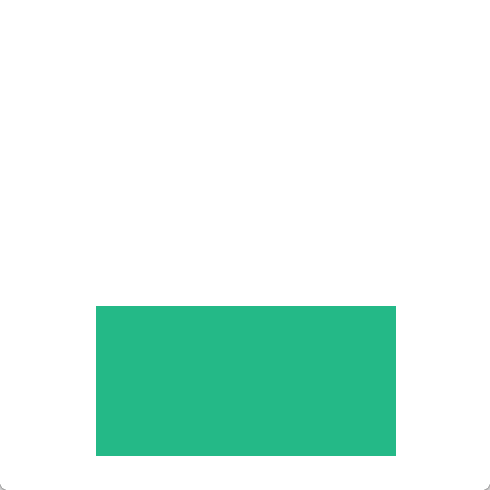
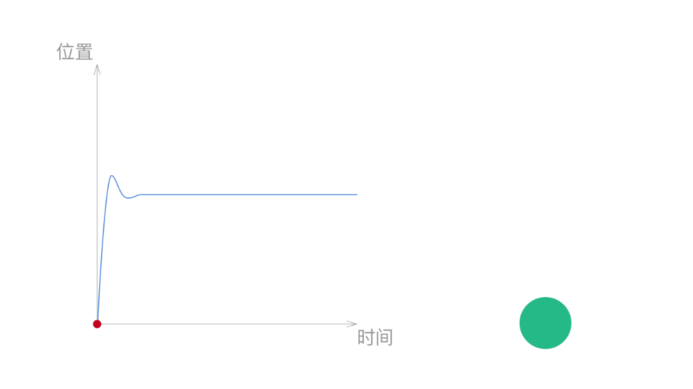
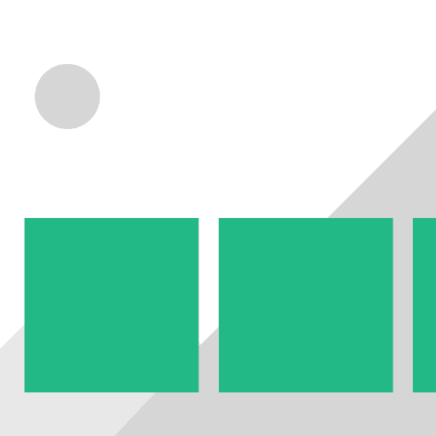
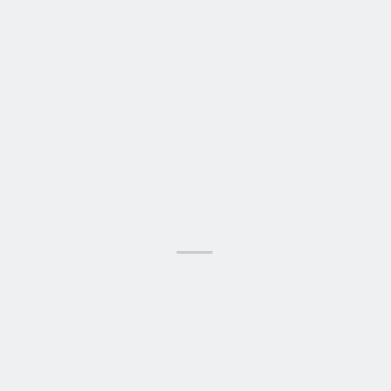
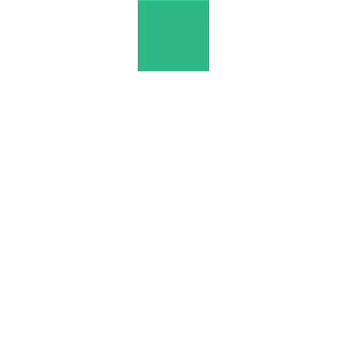
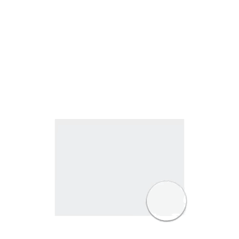

# 概述

## 动效作用

一个常见的误区是动效只是让你已有的设计变的更加好看，通常是在设计完成以后再加上去的点缀。当然动效能给UI带来活力，但更重要的是它还能增强用户体验。一个动效出现在页面上，是为了起到某些作用，而不是为了加动效而加。通常动效的作用有以下这些：

* **提供反馈：** 通常需要用户来触发，并不仅仅是提供结果，更重要的是告诉用户系统收到了指令。
* **提示：** 动效可以通过动画来吸引用户的注意，起到提示的作用。
* **层级关系：** 通过上下，前后的位置变化来表现层级关系。
* **连续性：** 从一个状态变成另一个状态时通过过渡的动画使前后能关联起来，让整个转换更加流畅。

## 可交互和不可交互的动效

动效大致可分为可交互和不可交互的，我们用的最多的是不可交互的动效，当它被触发了以后，它就按照设定好的方式开始播放，直到停止。而可交互的动画，用户可以来实时控制动画的进度。同一个动画可以同时拥有可交互的和不可交互的两种状态。最常见的就是iOS返回上一页面的动画，当你按下返回键时候，它是以不可交互的模式来就行播放的，当用户选择用手势右滑返回时，整个动画的进度都是由用户来控制的。

## 物理特性

好的动效应该遵循物理规律，是符合生活常识的。在生活中我们能对物体的运动进行预测，当一个球要从桌子上滚下去时，我们可以预期当球离开桌面时它会往下掉，而不是往天上飞，我们把这个叫做常识。我们可以把一些UI元素看成是真实的物体，他有重量，符合物理规律。比如物体不会凭空出现和消失，不会突然变化位置，符合物理规律的动效更容易让人理解，同时也会显得更自然。

## 需要避免的问题

动效不是动画片，很少会有用户会从当前的操作中停下来观看你的动画。时间太长，太过花哨的动画不仅不能帮助用户，甚至还会造成干扰。

好的动效因该是多方配合的产物，它不仅需要出色的视觉设计，同时也需要工程师的努力才是使它落地。

# 时间和动画曲线

## 时间

尽管没有一个标准来规定动效的时间应该是多少，不过还是有研究证明，对于人的感知来讲，0.1s像是瞬间发生的，是人类感知的极限，而当时间超过1s后，则明显感到被打断了，能感受到延迟。UI中的大部分动效，通常会把时间的上限控制在0.5s以内，常用的时间范围是0.2s-0.4s。影响动效用时的因素有很多，比如移动距离很长，或者变化幅度比较大的动效，通常需要长一点的时间，反之，对于一些变化小，简单的动效，可以选用短一点的时间。

正如一下开始说的，动效的持续时间是没有绝对的标准的，前面提供的时间可以给你提供一个参考。在具体使用时要根据动画的效果来选用时间，而不是硬套上面的数字。

### 时间差

对一组类似元素的动画，通常我们不会让他们同时发生，而会在每组动画之间设置一个时间差，从而取得更好的节奏感和秩序感。

## 动画曲线

动画曲线是一个动效中重要的组成部分，却往往也是最容易被忽略的地方，动画曲线控制着整个动画的进程。现实生活中的运动都不是线性的，比如开一辆车，启动时我们需要加速，将要达到目的地时，则需要慢慢减速。这些是我们习以为常的事情，当我们在屏幕上看到物体运动时，如果它符合生活中的常识，这样的动画会显得更自然。动画曲线，正是用来控制物体运动的工具。

### 动画曲线的构成

动画曲线通常是一条贝塞尔曲线构成的，它是由两个控制点来控制的，如右图所示。这是一个物体的变化和时间之间的图像。曲线越陡的地方代表变化的速运越快。通过曲线的陡峭程度的变化，我们就能看出速度的变化。右图表示的就是一个很快加速，然后再慢慢减速的过程。

### Linear

线性变化，从图中可以看出这是一个匀速的运动过程，从开始到结束的过程中没有加速也没有减速，显然这不是太符合我们的生活常识，大部分情况下我们需要避免使用这种曲线。

### EaseIn

加速曲线，从图中可以看出物体从静止开始不停加速，到终点时物体达到了最快的速度。这种曲线的通常在物体离开我们视线的情况下使用。如右边的例子中，物体在屏幕中开始加速，并以最快的速度离开屏幕。

### EaseOut

减速曲线，从图中可以看出物体以最快速度开始，之后不停减速，到终点时物体速度为零。这种曲线的通常在物体进入我们视线的情况下使用。如右边的例子中，物体在屏幕外开始加速，以最快的速度进入屏幕，并且不停地减速，最后停在屏幕中间。

### EaseInOut

先加速后减速，从图中可以看出物体从静止开始加速，到达一定的速度之后减速，到终点时物体速度为零。这种曲线的通常在物体在我们视线内移动的情况下使用。如右边的例子中，物体以从屏幕中的一个位置开始加速，然后再慢慢减速达到目标位置。

对于大部分UI中出现的动效来说，上面几种常用的动画曲线已经足够用了。不过你也可以自己定义动画曲线，如果你这么做了，你需要告诉开发人员你自定义动画曲线的参数，通常是两个控制点的位置，只有有了两个控制点的参数，工程师才有可能将你自定义的动画曲线还原出来。

### Spring

除此之外你还可以使用弹性动画，当物体到达终点位置时，它不会马上停止，而是会超过终点，并在终点位置来回摆动，最后慢慢停在终点位置。弹性动画通常需要通过调整弹性的强度，阻力等参数来控制，而不是直接给出动画的时间参数。 需要说明的是，第一眼看上去，弹性动画非常容易吸引眼球，使用时也要看场合，过度的使用弹性动画往往会事得起反。

# 使用场景

每个软件的使用过程都是动态的。不过对于大部分设计师而言，UI设计还是停留在一个又一个的静态页面，而不会去时刻考虑各个静态页面之间的衔接过程。因为缺乏对中间过程的考虑，一些问题只有在开发的过程中才会显现出来。实际使用时缺乏前后关联。 尽管动效可以渗透到App的每一个角落，我们还是可以总结出一些通常需要动效的场合。帮助设计师在静态设计的阶段就考虑好流程中的衔接问题。

## 出现和消失

### 已有的基础上

在已有的基础上出现或者消失，除了出现和消失的元素之外，页面其他的元素也要跟着变化，并且其他变化的动效参数和主角保持一致，如使用相同的时间，相同的动画曲线。

### 新的层级上

新出现的内容和原内容不在一个层级，增加和消失不影响原先的内容。如常见的弹框。

## 承前启后

### 整体过渡

以页面为基础，整体的转化。这也是最常用的页面过渡方式。

### 自身的变化

当同一个元素从状态A变成状态B时，给变化的过程增加动效，使状态的变化更连贯自然。

### 前后串联

如前后页面有共用元素，可以以该元素为基础，将两个页面串联起来。通过这种方式来引导用户的注意力。注意共用元素不要太多，容易造成混乱。

## 操作反馈

### 颜色变化

当用户点击目标后，被点击目标通过变化颜色提示用户，软件接收到用户的操作指示。

### 大小变化

当用户点击目标后，被点击目标通过变化大小，提示用户软件接收到用户的操作指示。

## 吸引注意

### 吸引注意

人的注意力很容易被运动的物体所吸引。面对复杂的页面，用户的关注点和设计师的预期往往会有出入。这时候如果使用动效，很容易就能引起用户的注意。如常用的错误提示，信息反馈等。

## 视差效果

### 视差

增加层次感，位于不同层级上的内容滑动时，通过前后两层速度不同来显示空间感，靠近用户的层移动速度快，后面的背景速度慢。

## 趣味性动画

### 趣味性动画

好的动效，不仅仅能满足功能性的要求。它还能给你的界面带来活力。使你的设计能更有吸引力，让人眼前一亮。

# 风格和其他

## 动效风格

创造自己的动效风格，能够让你的UI更加出色，增加辨识度。需要注意的是，在设计的时候，定好一种动效的风格后，最好能一直贯彻下去，给你的UI营造出统一的感觉。

通过调整不同的动效参数，我们可以营造出不同的感觉，可以称之为动效的风格。为了达到更好的效果，动效的风格需要和视觉风格来统一。

通过使用不同的动效时间，变化幅度，动画曲线等参数可以营造出不同的感觉。

### 跳跃有趣的

较大的变化幅度，适中的动效时间和较大弹性的配合能营造出活泼可爱的感觉。当弹性较小时，效果和普通动画曲线类似。弹性变强时，能增加页面的戏剧性，常常适用于一些卡通，趣味化的场景。

### 柔和顺滑的

较小的变化幅度，配上较长的动效时间能让动画显得柔和。这样的效果能够尽可能减小对用户的干扰，营造出一种顺滑的感觉。

### 简单直接的

适中的变化幅度，配上较短的动效时间，能营造出一种干脆利落的感觉，给人一种确定感。

不同动画参数之间的配合可以打造出很多种风格，以上只是举了三个例了说明。

# 更多可能

之前介绍的常用在动效设计上的方法，如通过定义动画时间，动画曲线等参数来控制动画效果。随着技术的不断发展，越来越多的可能性也随之出现。如在第二部分中介绍的动画曲线中，通过使用加速（easeIn），减速（easeOut）曲线来给用户一种真实物体运动的感觉。

### 物理引擎

更直接的做法是在屏幕里面模拟出一个真实的世界，里面的元素有重量，会在力的作用下运动。由于这样的运动是基于物理定律的，出来的效果也就更加贴近生活 ，更容易让用户理解。

### 不同方式的下落对比

左边是传统的做法，物体从位置一（上）运动到位置二（下），给定一个时间，并且使用加速动画曲线（easeIn）来模拟物体下落的过程。

右边是基于物理定义的动画，定义了绿色方块的重量，并且对它施加了一个向下的力。绿色方块在这个力的作用下向下加速运动，直到接触到底部后反弹一下然后再静止。这是我们生活中习以为常的物体下落的方式。反观第一种方式，当绿色方块接触到底部时，它的速度瞬间从最高变成了零，这是不符合生活常识的。而当这个动效在不同尺寸的设备上出现时，由于第一种方式的时间是固定的，在不同的屏幕高度下，他下落的时间也是固定的。而第二种下落的时间则是根据下落的高度计算出来的，更符合常识。

基于物理定律的动画不仅能给人真实感，同时也能给用户提供更多的操控感觉。如物体移动的速度可以由用户滑动的速度决定，与传统的动画相比，这里的时间由用户来控制，更真实。

### 三维空间

UI界面通常都是在二维空间生存的，虽然在设计的过程中页面元素之间通常会有前后的层级关系，但是最终体现在界面上的都是在同一平面上。增加一个维度后，用户更能理解页面的前后层级关系，同时给交互设计也带来了一个新的维度。在UI设计中体现前后维度，能让各种状态之间的变化更连续，接近生活中的操作。通常可以使用页面的翻折效果，阴影等方式来体现3D空间。

