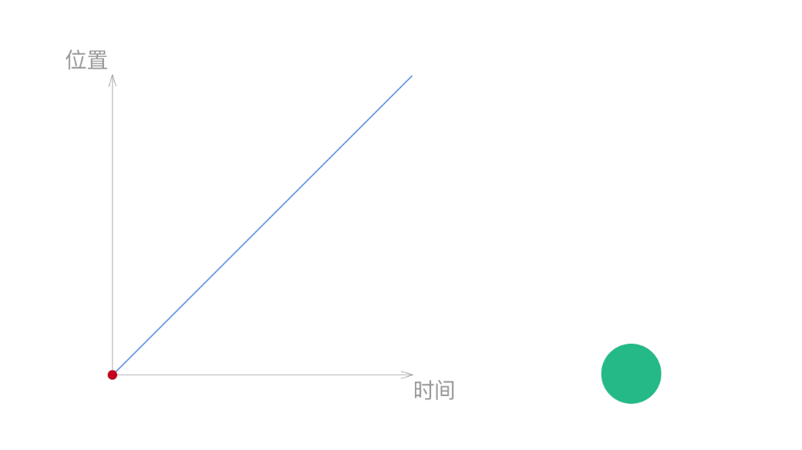
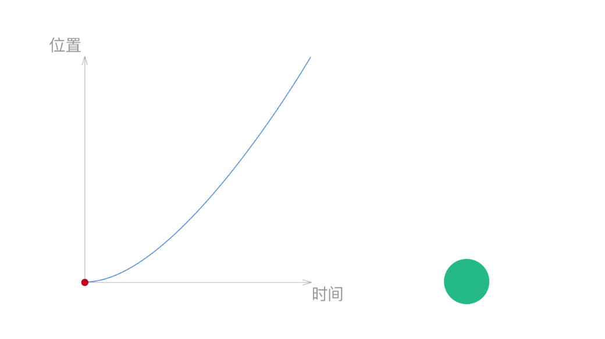
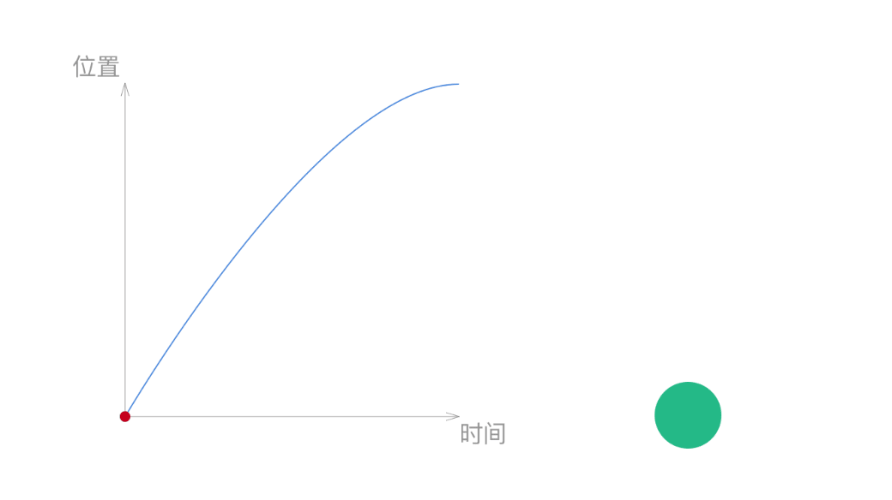
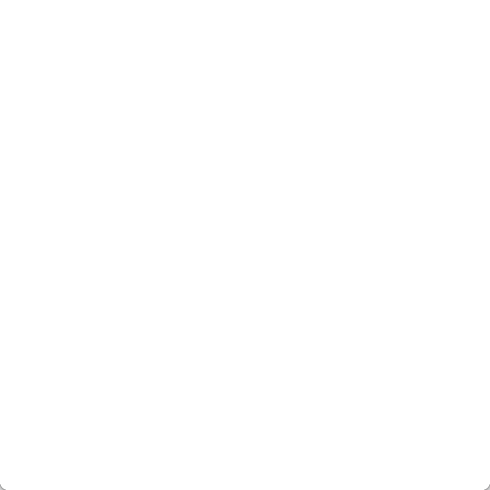

# 时间和动画曲线

## 时间

尽管没有一个标准来规定动效的时间应该是多少，不过还是有研究证明，对于人的感知来讲，0.1s像是瞬间发生的，是人类感知的极限，而当时间超过1s后，则明显感到被打断了，能感受到延迟。UI中的大部分动效，通常会把时间的上限控制在0.5s以内，常用的时间范围是0.2s-0.4s。影响动效用时的因素有很多，比如移动距离很长，或者变化幅度比较大的动效，通常需要长一点的时间，反之，对于一些变化小，简单的动效，可以选用短一点的时间。

正如一下开始说的，动效的持续时间是没有绝对的标准的，前面提供的时间可以给你提供一个参考。在具体使用时要根据动画的效果来选用时间，而不是硬套上面的数字。

**时间差**

对一组类似元素的动画，通常我们不会让他们同时发生，而会在每组动画之间设置一个时间差，从而取得更好的节奏感和秩序感。

## 动画曲线

动画曲线是一个动效中重要的组成部分，却往往也是最容易被忽略的地方，动画曲线控制着整个动画的进程。现实生活中的运动都不是线性的，比如开一辆车，启动时我们需要加速，将要达到目的地时，则需要慢慢减速。这些是我们习以为常的事情，当我们在屏幕上看到物体运动时，如果它符合生活中的常识，这样的动画会显得更自然。动画曲线，正是用来控制物体运动的工具。

**动画曲线的构成**

动画曲线通常是一条贝塞尔曲线构成的，它是由两个控制点来控制的，如右图所示。这是一个物体的变化和时间之间的图像。曲线越陡的地方代表变化的速运越快。通过曲线的陡峭程度的变化，我们就能看出速度的变化。右图表示的就是一个很快加速，然后再慢慢减速的过程。

**Linear**

线性变化，从图中可以看出这是一个匀速的运动过程，从开始到结束的过程中没有加速也没有减速，显然这不是太符合我们的生活常识，大部分情况下我们需要避免使用这种曲线。

**EaseIn**

加速曲线，从图中可以看出物体从静止开始不停加速，到终点时物体达到了最快的速度。这种曲线的通常在物体离开我们视线的情况下使用。如右边的例子中，物体在屏幕中开始加速，并以最快的速度离开屏幕。

**EaseOut**

减速曲线，从图中可以看出物体以最快速度开始，之后不停减速，到终点时物体速度为零。这种曲线的通常在物体进入我们视线的情况下使用。如右边的例子中，物体在屏幕外开始加速，以最快的速度进入屏幕，并且不停地减速，最后停在屏幕中间。

**EaseInOut**

先加速后减速，从图中可以看出物体从静止开始加速，到达一定的速度之后减速，到终点时物体速度为零。这种曲线的通常在物体在我们视线内移动的情况下使用。如右边的例子中，物体以从屏幕中的一个位置开始加速，然后再慢慢减速达到目标位置。

对于大部分UI中出现的动效来说，上面几种常用的动画曲线已经足够用了。不过你也可以自己定义动画曲线，如果你这么做了，你需要告诉开发人员你自定义动画曲线的参数，通常是两个控制点的位置，只有有了两个控制点的参数，工程师才有可能将你自定义的动画曲线还原出来。

**Spring**

除此之外你还可以使用弹性动画，当物体到达终点位置时，它不会马上停止，而是会超过终点，并在终点位置来回摆动，最后慢慢停在终点位置。弹性动画通常需要通过调整弹性的强度，阻力等参数来控制，而不是直接给出动画的时间参数。 需要说明的是，第一眼看上去，弹性动画非常容易吸引眼球，使用时也要看场合，过度的使用弹性动画往往会事得起反。

