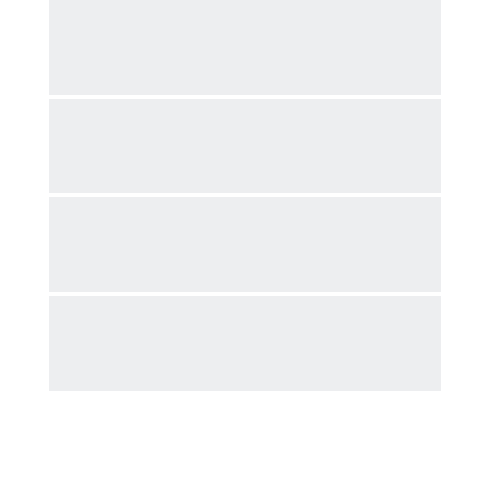
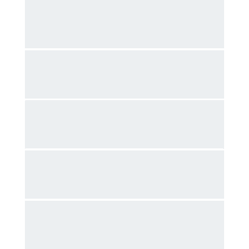
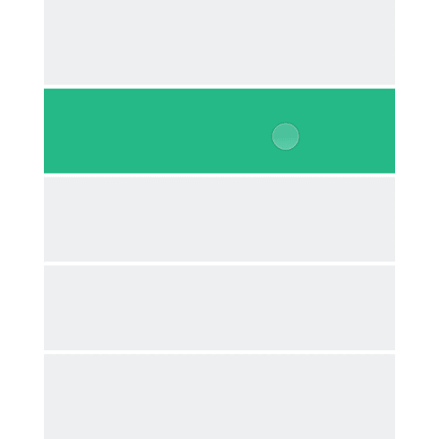
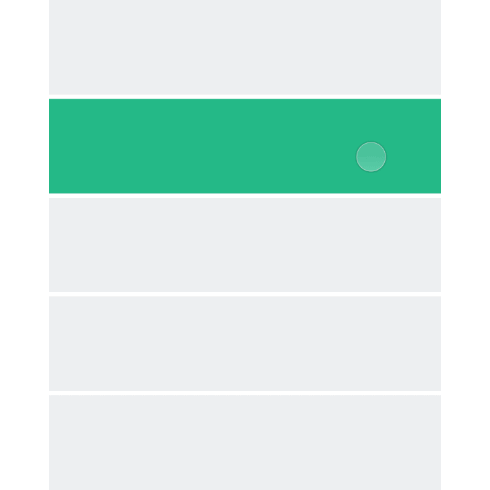
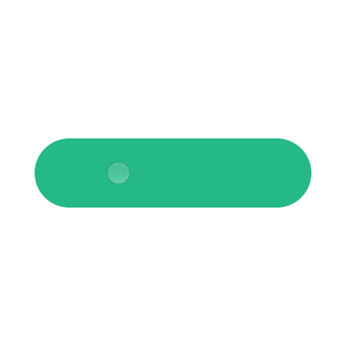
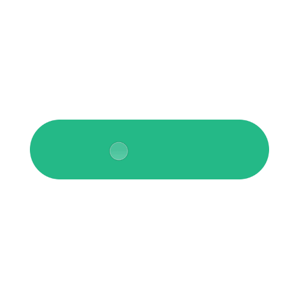
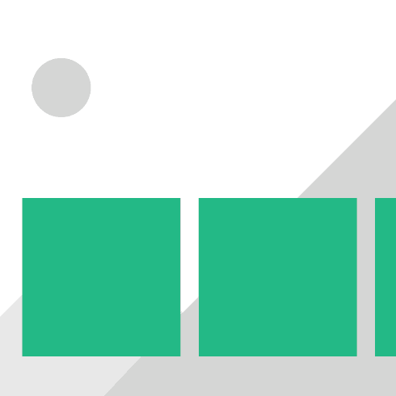

#使用场景

每个软件的使用过程都是动态的。不过对于大部分设计师而言，UI设计还是停留在一个又一个的静态页面，而不会去时刻考虑各个静态页面之间的衔接过程。因为缺乏对中间过程的考虑，一些问题只有在开发的过程中才会显现出来。实际使用时缺乏前后关联。 尽管动效可以渗透到App的每一个角落，我们还是可以总结出一些通常需要动效的场合。帮助设计师在静态设计的阶段就考虑好流程中的衔接问题。

##出现和消失

**已有的基础上**

在已有的基础上出现或者消失，除了出现和消失的元素之外，页面其他的元素也要跟着变化，并且其他变化的动效参数和主角保持一致，如使用相同的时间，相同的动画曲线。

**新的层级上**

新出现的内容和原内容不在一个层级，增加和消失不影响原先的内容。如常见的弹框。

##承前启后

**整体过渡**

以页面为基础，整体的转化。这也是最常用的页面过渡方式。

**自身的变化**

当同一个元素从状态A变成状态B时，给变化的过程增加动效，使状态的变化更连贯自然。

**前后串联**

如前后页面有共用元素，可以以该元素为基础，将两个页面串联起来。通过这种方式来引导用户的注意力。注意共用元素不要太多，容易造成混乱。

##操作反馈

**颜色变化**

当用户点击目标后，被点击目标通过变化颜色提示用户，软件接收到用户的操作指示。

**大小变化**

当用户点击目标后，被点击目标通过变化大小，提示用户软件接收到用户的操作指示。

##吸引注意

**吸引注意**

人的注意力很容易被运动的物体所吸引。面对复杂的页面，用户的关注点和设计师的预期往往会有出入。这时候如果使用动效，很容易就能引起用户的注意。如常用的错误提示，信息反馈等。

##视差效果

**视差**

增加层次感，位于不同层级上的内容滑动时，通过前后两层速度不同来显示空间感，靠近用户的层移动速度快，后面的背景速度慢。

##趣味性动画

**趣味性动画**

好的动效，不仅仅能满足功能性的要求。它还能给你的界面带来活力。使你的设计能更有吸引力，让人眼前一亮。

