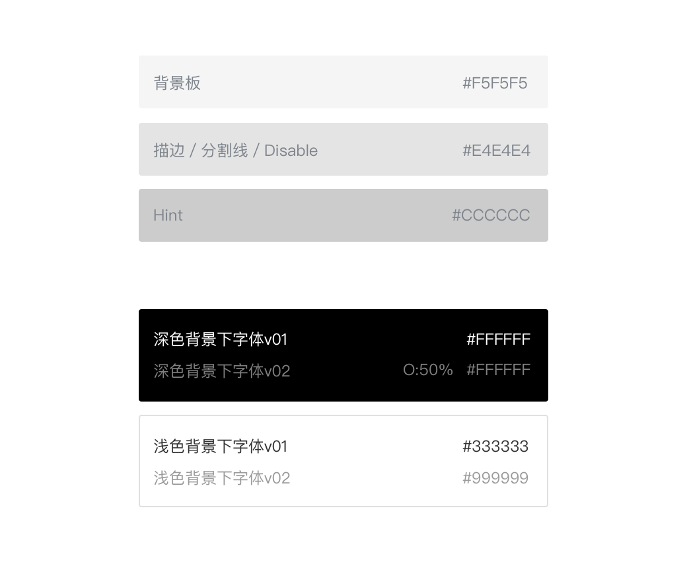
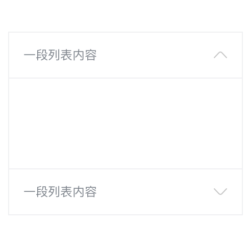
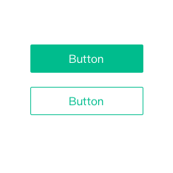

```js
const a = 'hello'
console.log(a)
```

```python
def say(hello):
    print(hello)
```

```scheme
(+ 1 1)
(define hello 2)
```

```go
package main
func main() {
    fmt.Println("hello world")
}
```


# 色彩原则

色彩是最直接传达给用户的元素，在设计中要遵从基本色彩语言，继承品牌，体现产品属性及用户定位等特点，同时色彩还需要指引操作、传达反馈等使交互更清晰。DianRongUI的色彩在应用上需要注意以下几点：

* 准确：品牌色应与产品定位相契合，且符合用户心理认知
* 清晰: 视觉层次应清晰分明，操作上利用色彩变化表现出交互反馈
* 统一: 每一个产品只有一个品牌主色，在重要行动点或关键信息或标准控件上应使用主色彩，保证视觉延续性

---

## 色板


以点融线上品牌色为基准饱和度100%，明度74%，横向纬度创造14标准色色板，由于色彩本身视觉偏差，明度会有上下浮动，保证色彩视觉平衡。以下色板＃5为基础色，在向黑白过度中产生色阶，生成8种衍生色。


## 色彩应用

### 品牌色


品牌色是体现产品特性和传播理念最直观的视觉元素之一。一旦确立品牌主色彩，在应用时，要体现在关键行动点及操作状态、重要信息高亮等场景。

某些场景下，可以根据主色左右浮动变化来达到界面效果，呈现良好的视觉体验。

### 无彩色




黑白灰是界面中常用的色彩，它的使用有利于划分层次，突出信息，通常用在背景、描边、分割线、字体等，在多产品线App中，我们统一了无彩色系的使用标准。

在某些情况下，无彩色可以向有彩色偏移，来达到最优视觉效果，例如蓝灰，绿灰等..

### 功能色


除了品牌色外，还有具备特定含义的功能色，根据色彩语言定义功能本身的色彩，像成功、失败、等待、提醒等等...

### 视觉层次

<div hasmanyimage>




</div>

中性灰色层级划分，在设计中经常遇到页面只能利用灰度表现设计层次，其设计原则s自上到下梯度变化为从浅到深

### 识别性

<div hasmanyimage>



</div>

在点融色板使用中与文字需要保持清晰识别性。

