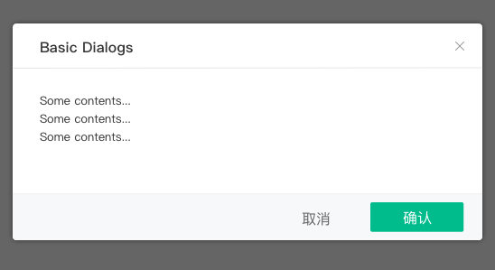
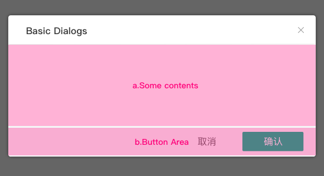
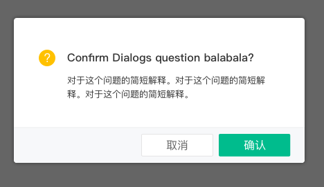

# # 对话框 Dialogs
点击按钮后，在当前页面弹出对话框，承载相应操作。

**1.基本 Basic**

**2.带组件的对话框 Dialogs with Selection**

a. 中间区域可是任何组件，比如：输入框、滚轮文字、表单等等...
b. 按钮区域可变化为各种样式，比如：两个无框文字按钮，两个有框按钮等等...

**3.确认对话框 Confirm Dialogs**

