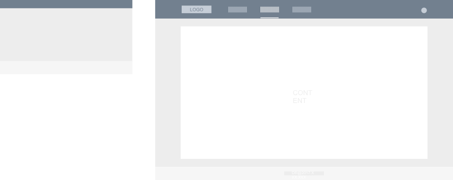
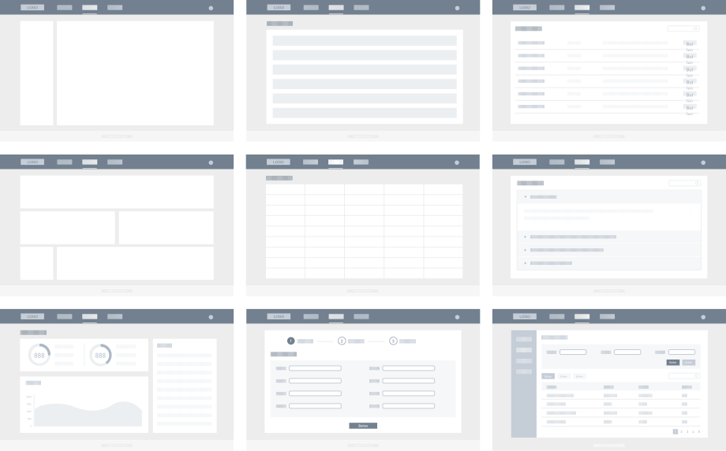
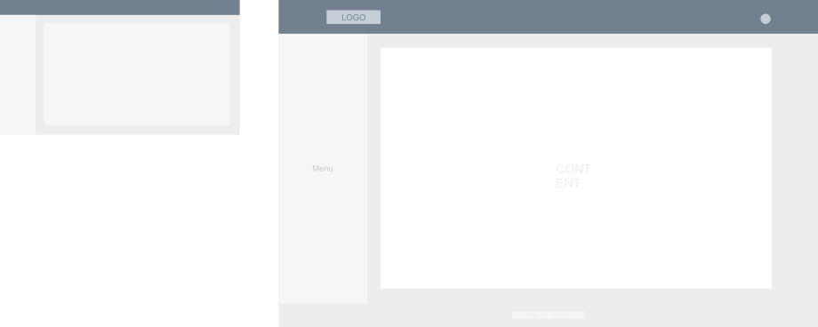
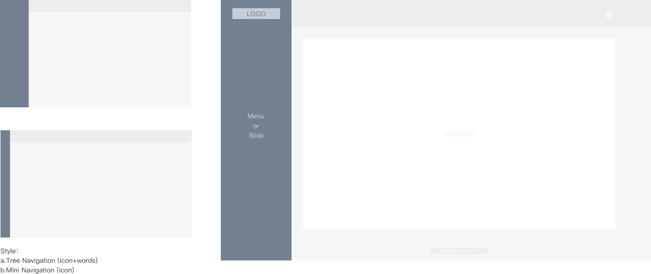
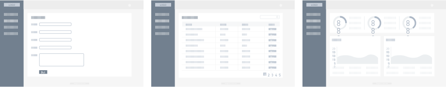

# 布局 Layout
帮助网站开发人员选择最符合产品呈现的页面整体布局。此版本给出了3种样式给予选择。

## 设计规则
#### **尺寸**

* 顶部导航（大部分系统）：一级导航高度 72px，二级导航 45px。
* 顶部导航高度的范围计算公式为：45+8n。
* 侧边导航宽度的范围计算公式：200+8n。

#### **视觉**

导航样式上需要根据信息层级合理的选择样式：

* **大色块强调**
建议用于底色为深色系时，当前页面父级的导航项。

* **高亮火柴棍**
当导航栏底色为浅色系时使用，可用于当前页面对应导航项，建议尽量在导航路径的最终项使用。

* **字体高亮变色**
在深色底上，字体需要与底色产生强烈明暗反差；在浅色底上，建议使用产品相对应品牌色

* **字体放大**
所有导航字号皆为 16 号字体，用在一、二级导航中。字号可以考虑导航项的等级做相应选择。

## 模版展示
**1.上中下三行布局**

内容布局样例

**2.顶层栏**

**3.顶部-侧边布局**

内容布局样例

