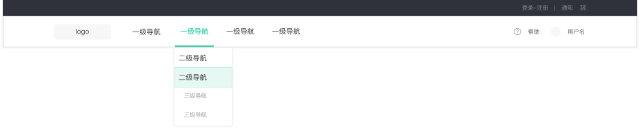
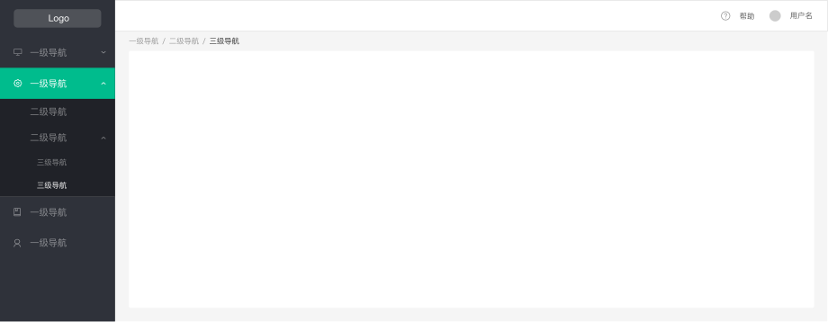

# 导航菜单 Menu
Toolbar通常由多种类型的组件组成。
网页一般分为顶部导航和侧边导航，顶部导航提供全局性的类目和功能，侧边导航提供多级结构来收纳和排列网站架构。

**1.顶层菜单**

**顶层菜单_二级导航菜单**

* 一级导航文字前不加icon

**2.侧边菜单**

* 一级导航文字前加icon
* 默认Open第一个导航中的第一项
* 登入后，不要显示空白页，直接进入一级导航

