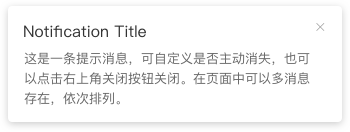
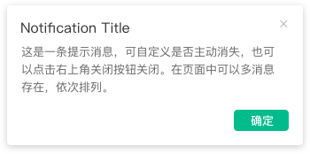
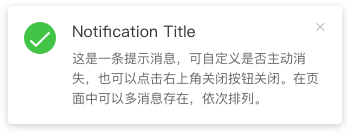
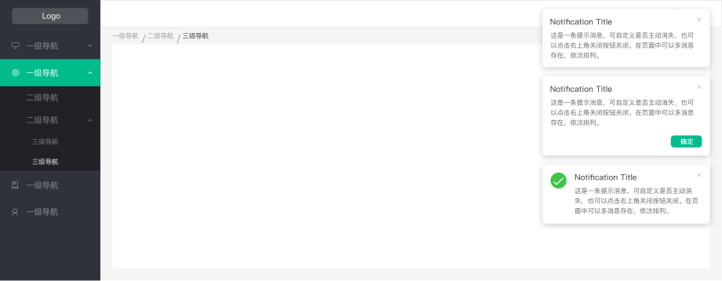

# 通知提醒框 Notification

1. 通知类，在页面加载完成后新消息推送
2. 需要手动关闭
3. 如自动关闭，默认4.5秒
4. 可自定义图标以及按钮
5. 暂不支持自定义框长度与显示位置
6. 当弹出多个通知提醒框时，右上角从时间线依次向下排列

**1.基本提醒框 Basic Notification**

**2.带按钮的提醒框 with Button**

**3.带图标的提醒框 with Icon**

eg:

