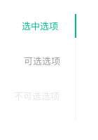

# 标签页 TOOLBAR-Tabs
选项卡切换组件

**1.线条式页签 Linear Tabs**

多用户容器内部多主功能切换，这是最常用的Tabs。

**2.带图标的线条式页签 Linear Tabs with Icon**

**3.带按钮的线条式页签 Linear Tabs with Button**

**4.带标签的线条式页签 Linear Tabs with Badge**

**5.小型线条式页签 Mini Linear Tabs**

**6.垂直页签 Vertical Tabs**

